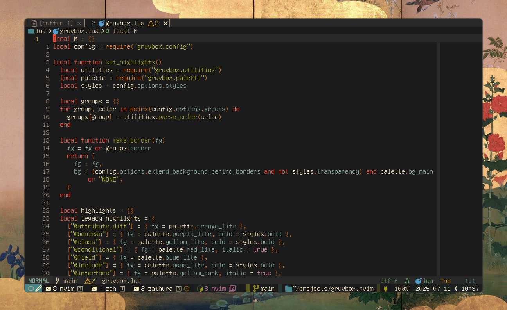
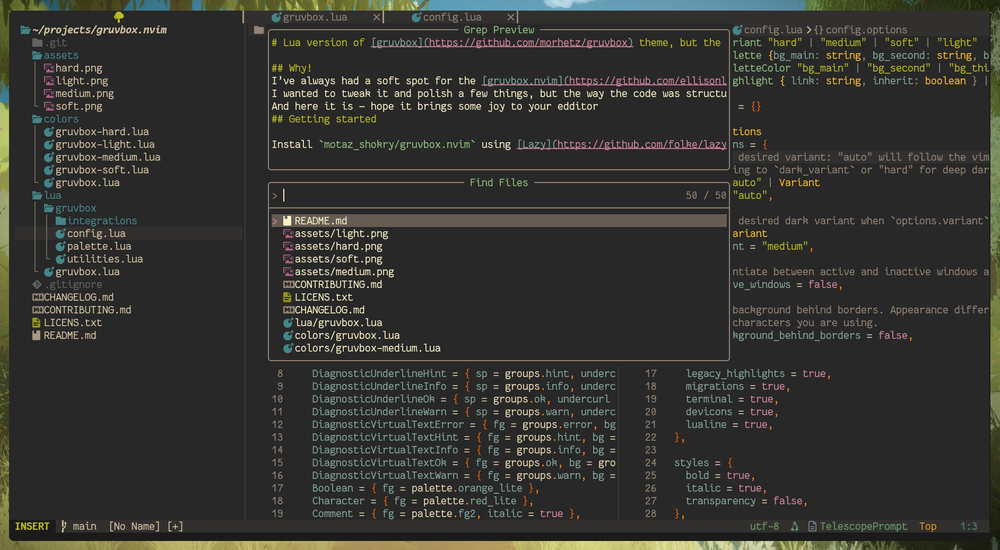
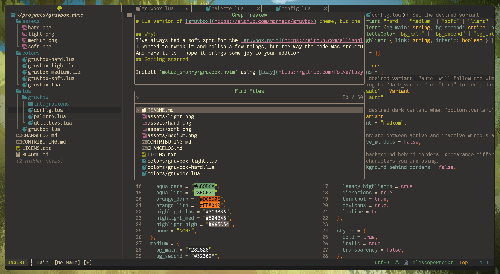
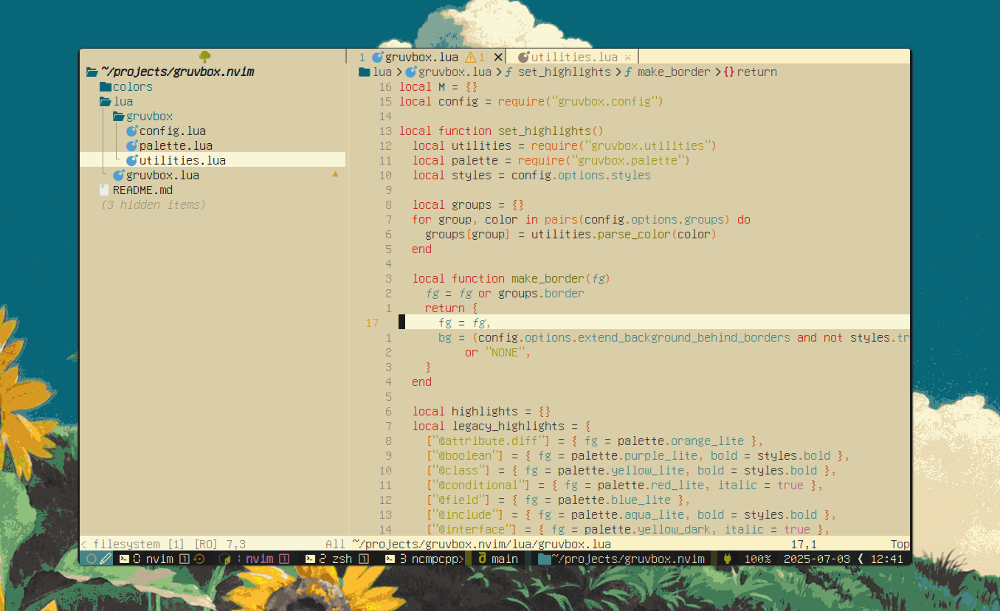

# Lua version of [gruvbox](https://github.com/morhetz/gruvbox) theme, but the hard variant background is "#1b1b1b" not "#1d2021" 🙃.

## Why!
I’ve always had a soft spot for the [gruvbox.nvim](https://github.com/ellisonleao/gruvbox.nvim) theme, so I gave that gruvbox.nvim a try. Sadly, the visual design didn’t land well for me — especially the background color: a harsh #1d2021 instead of the smoother #1b1b1b I’m used to.
I wanted to tweak it and polish a few things, but the way the code was structured didn’t leave much room for flexibility. So, I rolled up my sleeves and built my own flavor of gruvbox, inspired by the elegant architecture of [rose pine](https://github.com/rose-pine/neovim).
And here it is — hope it brings some joy to your edditor
## Getting started

Install `motaz_shokry/gruvbox.nvim` using [Lazy](https://github.com/folke/lazy.nvim) package manager:

```lua
-- lua/plugins/gruvbox.lua
return {
	"https://gitlab.com/motaz-shokry/gruvbox.nvim",
	name = "gruvbox",
    priority = 1000,
	config = function()
		vim.cmd("colorscheme gruvbox")
	end
}
```

## Screen Shots

**Gruvbox Hard Variant**



**Gruvbox Medium Variant**



**Gruvbox Soft Variant**



**Gruvbox Light Variant**



## Options

> [!IMPORTANT]
> Configure options _before_ setting colorscheme.

Gruvbox has four variants: hard, medium, soft and light. By default, `vim.o.background` is followed, using light when light and `dark_variant` when dark.

```lua
require("gruvbox").setup({
  variant = "hard",        -- auto, hard, medium, soft, light
  dark_variant = "medium", -- hard, medium, soft
  dim_inactive_windows = false,
  extend_background_behind_borders = false,

  enable = {
  terminal = true,
  legacy_highlights = true, -- Improve compatibility for previous versions of Neovim
  migrations = true,        -- Handle deprecated options automatically
  },

  styles = {
  bold = true,
  italic = true,
  transparency = false,
  },

  groups = {
  -- UI Elements
  border = "gray",
  link = "purple_lite",
  panel = "bg_second",

  -- Diagnostic levels
      error = "red_lite",
  hint = "aqua_lite",
  info = "blue_lite",
  ok = "green_lite",
  warn = "yellow_lite",
  note = "yellow_dark",
  todo = "aqua_dark",

  -- Git states
      git_add = "green_dark",
  git_change = "yellow_dark",
  git_delete = "red_dark",
  git_dirty = "orange_dark",
  git_ignore = "gray",
  git_merge = "purple_dark",
  git_rename = "blue_dark",
  git_stage = "purple_dark",
  git_text = "yellow_lite",
  git_untracked = "bg2",

  -- Headings
      h1 = "red_dark",
  h2 = "yellow_dark",
  h3 = "green_dark",
  h4 = "aqua_dark",
  h5 = "blue_dark",
  h6 = "purple_dark",
  },

  palette = {
      -- Override the builtin palette per variant
          -- hard = {
              --     bg_main = "#1D2021",
              --     fg = "#D4C5A0",
              -- },
  },

  -- NOTE: Highlight groups are extended (merged) by default. Disable this
      -- per group via `inherit = false`
      highlight_groups = {
          -- Comment = { fg = "gray" },
          -- StatusLine = { fg = "bg1", bg = "bg1", blend = 15 },
          -- VertSplit = { fg = "bg4", bg = "bg4" },
          -- Visual = { fg = "bg_second", bg = "fg1", inherit = false },
      },

  before_highlight = function(group, highlight, palette)
      -- Disable all undercurls
      -- if highlight.undercurl then
      --     highlight.undercurl = false
      -- end
      --
      -- Change palette colour
      -- if highlight.fg == palette.blue_lite then
      --     highlight.fg = palette.purple_lite
      -- end
      end,
})

vim.cmd("colorscheme gruvbox")
-- vim.cmd("colorscheme gruvbox-hard")
-- vim.cmd("colorscheme gruvbox-medium")
-- vim.cmd("colorscheme gruvobx-soft")
-- vim.cmd("colorscheme gruvobx-light")
```

## Contributing

We welcome and appreciate contributions of any kind. Create an issue or start a discussion for any proposed changes. Pull requests are encouraged for supporting additional plugins or [treesitter improvements](https://github.com/nvim-treesitter/nvim-treesitter/blob/master/CONTRIBUTING.md#highlights).

Feel free to update the [README](https://gitlab.com/motaz-shokry/gruvbox.nvim/README) with any improvements.
